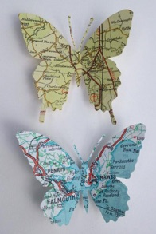

<!-- README.md is generated from README.Rmd. Please edit that file -->

```{r, include = FALSE}
knitr::opts_chunk$set(
  collapse = TRUE,
  comment = "#>",
  fig.path = "man/figures/README-",
  out.width = "100%"
)
library(mapirosa)
```

# mapirosa


<!-- badges: start -->
<!-- badges: end -->

## `r readLines(here::here("DESCRIPTION")) |> stringr::str_subset("^Title") |> stringr::str_extract("(?<=: ).*")`

`r readLines(here::here("DESCRIPTION")) |>stringr::str_subset("^Description") |> stringr::str_extract("(?<=: ).*")`


<!-- http://www.rocketandco.co.uk/Site/Butterfly_Map_Art_files/final1.jpg -->



## Installation

```r
remotes::install_github("francisbarton/mapirosa")
```

## Examples

```{r examples}
if (requireNamespace("osmdata")) {
  oxford <- create_bbox("Oxford", 27700)
} else {
  oxford <- c(
      xmin = 448100.3,
      ymin = 201646.6,
      xmax = 457014.2,
      ymax = 211088.8)
}

oxford_basemap <- build_basemap(
  bbox = oxford,
  zoom = 5,
  style = "road",
  squarify = FALSE,
  crs = 27700)

oxford_basemap

if (requireNamespace("tmap")) {
  suppressMessages(tmap::tmap_mode("plot"))
  tmap::tm_shape(oxford_basemap, raster.downsample = FALSE) +
    tmap::tm_rgb(max.value = 1)
}

if (requireNamespace("osmdata", quietly = TRUE)) {
  oxford <- create_bbox("Oxford", 3857)
} else {
  oxford <- c(
      xmin = -145188.1,
      ymin = 6748034.5,
      xmax = -130890.9,
      ymax = 6763371.2)
}

oxford_basemap <- build_basemap(
  bbox = oxford,
  zoom = 12,
  style = "outdoor",
  squarify = TRUE,
  crs = 3857)

oxford_basemap

# tidyterra: https://dieghernan.github.io/tidyterra/reference/geom_spatraster_rgb.html)

if (requireNamespace("ggplot2") & requireNamespace("tidyterra")) {
  ggplot2::ggplot() +
    tidyterra::geom_spatraster_rgb(
      data = oxford_basemap,
      maxcell = 1e7,
      max_col_value = 1) +
    ggplot2::coord_sf() +
    ggplot2::theme_void()
}
```

## Help

Does anyone know how to get it so that the PNG data comes back based on a maximum of 255 instead of a maximum of 1?


## OS Places API

_more info to come on this function_


## Further resources

* play about with the different OS map styles and the two CRSs
* ceramic
* slippymath
* basemaps
* OS resources on github
* Maps API technical specification
* 
