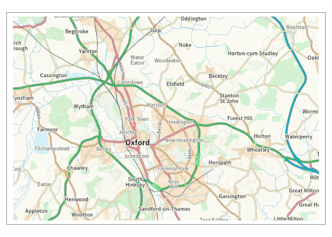
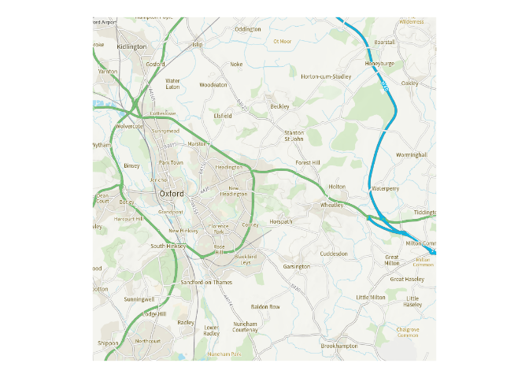

<!-- README.md is generated from README.Rmd. Please edit that file -->

# mapirosa

<!-- badges: start -->
<!-- badges: end -->

## Access OS OpenData APIs From R

A package to enable accessing basemap tiles from the [OS Maps
API](https://osdatahub.os.uk/docs/wmts/overview), initially. Access to
other OS (Ordnance Survey) Data Hub APIs may follow. The primary
motivation for this project was to find a map tile service that supplies
tiles in the British National Grid (27700) CRS, unlike the usual web
mapping standard CRS of 3857. The name of the package is an intentional
corruption of the Spanish word mariposa 🦋.

<!-- http://www.rocketandco.co.uk/Site/Butterfly_Map_Art_files/final1.jpg -->


## Installation

``` r
remotes::install_github("francisbarton/mapirosa")
```

## Examples

``` r
if (requireNamespace("osmdata")) {
  oxford <- create_bbox("Oxford", 27700)
} else {
  oxford <- c(
      xmin = 448100.3,
      ymin = 201646.6,
      xmax = 457014.2,
      ymax = 211088.8)
}

oxford_basemap <- build_basemap(
  bbox = oxford,
  zoom = 5,
  style = "road",
  squarify = FALSE,
  crs = 27700)

oxford_basemap
#> class       : SpatRaster 
#> dimensions  : 512, 768, 3  (nrow, ncol, nlyr)
#> resolution  : 28, 28  (x, y)
#> extent      : 442585, 464089, 200704, 215040  (xmin, xmax, ymin, ymax)
#> coord. ref. : OSGB36 / British National Grid (EPSG:27700) 
#> source      : memory 
#> names       : lyr.1, lyr.2, lyr.3 
#> min values  :     0,     0,     0 
#> max values  :     1,     1,     1

if (requireNamespace("tmap")) {
  suppressMessages(tmap::tmap_mode("plot"))
  tmap::tm_shape(oxford_basemap, raster.downsample = FALSE) +
    tmap::tm_rgb(max.value = 1)
}
```



``` r

if (requireNamespace("osmdata", quietly = TRUE)) {
  oxford <- create_bbox("Oxford", 3857)
} else {
  oxford <- c(
      xmin = -145188.1,
      ymin = 6748034.5,
      xmax = -130890.9,
      ymax = 6763371.2)
}

oxford_basemap <- build_basemap(
  bbox = oxford,
  zoom = 12,
  style = "outdoor",
  squarify = TRUE,
  crs = 3857)

oxford_basemap
#> class       : SpatRaster 
#> dimensions  : 768, 768, 3  (nrow, ncol, nlyr)
#> resolution  : 38.21882, 38.21882  (x, y)
#> extent      : -146760.3, -117408.2, 6741189, 6770541  (xmin, xmax, ymin, ymax)
#> coord. ref. : WGS 84 / Pseudo-Mercator (EPSG:3857) 
#> source      : memory 
#> names       :      lyr.1,      lyr.2,      lyr.3 
#> min values  : 0.03137255, 0.16470588, 0.02745098 
#> max values  :          1,          1,          1

# tidyterra: https://dieghernan.github.io/tidyterra/reference/geom_spatraster_rgb.html)

if (requireNamespace("ggplot2") & requireNamespace("tidyterra")) {
  ggplot2::ggplot() +
    tidyterra::geom_spatraster_rgb(
      data = oxford_basemap,
      maxcell = 1e7,
      max_col_value = 1) +
    ggplot2::coord_sf() +
    ggplot2::theme_void()
}

```


