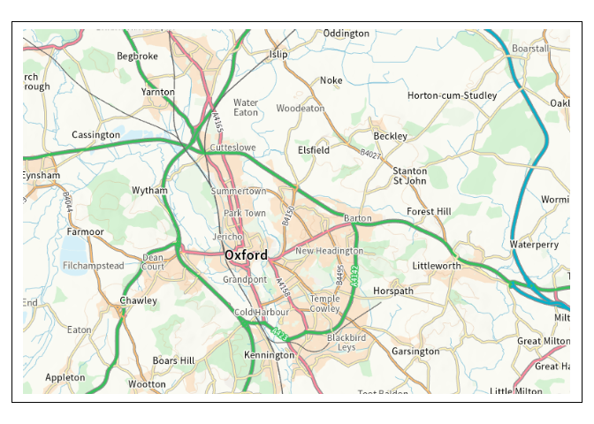
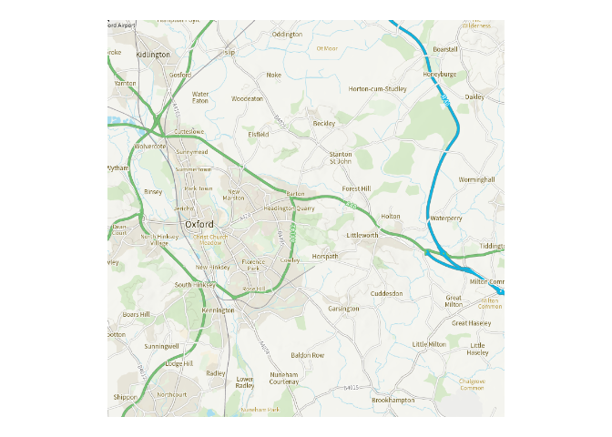

<!-- README.md is generated from README.Rmd. Please edit that file -->

# mapirosa

<!-- badges: start -->
<!-- badges: end -->

## Access OS OpenData APIs From R

A package to enable accessing basemap tiles from the [OS Maps
API](https://osdatahub.os.uk/docs/wmts/overview), initially. Access to
other OS (Ordnance Survey) Data Hub APIs may follow. The primary
motivation for this project was to find a map tile service that supplies
tiles in the British National Grid (27700) CRS, unlike the usual web
mapping standard CRS of 3857. The name of the package is an intentional
corruption of the Spanish word mariposa 🦋.

<!-- http://www.rocketandco.co.uk/Site/Butterfly_Map_Art_files/final1.jpg -->


## Installation

``` r
remotes::install_github("francisbarton/mapirosa")
```

To use the package you will need to have an API key from the Ordnance
Survey website. Save this as an environment variable called
`OS_DATA_KEY`

The easiest way to do this is to add a line to your `.Renviron` file
like:

`OS_DATA_KEY = abcd1234`

## Create basemaps using raster data (PNGs)

### Examples:

``` r

library(mapirosa)

if (requireNamespace("osmdata")) {
  oxford1 <- create_bbox("Oxford", 27700)
} else {
  oxford1 <- c(
    xmin = 448100.3,
    ymin = 201646.6,
    xmax = 457014.2,
    ymax = 211088.8
  )
}
#> Loading required namespace: osmdata

oxford_basemap1 <- build_basemap(
  bbox = oxford1,
  zoom = 5,
  style = "road",
  squarify = FALSE,
  crs = 27700
)
```

``` r
oxford_basemap1
#> class       : SpatRaster 
#> dimensions  : 512, 768, 3  (nrow, ncol, nlyr)
#> resolution  : 28, 28  (x, y)
#> extent      : 442585, 464089, 200704, 215040  (xmin, xmax, ymin, ymax)
#> coord. ref. : OSGB36 / British National Grid (EPSG:27700) 
#> source(s)   : memory
#> names       : lyr.1, lyr.2, lyr.3 
#> min values  :     0,     0,     0 
#> max values  :     1,     1,     1
```

``` r
if (requireNamespace("tmap")) {
  suppressMessages(tmap::tmap_mode("plot"))
  tmap::tm_shape(oxford_basemap1, raster.downsample = FALSE) +
    tmap::tm_rgb(max.value = 1)
}
#> Loading required namespace: tmap
```



``` r
if (requireNamespace("osmdata", quietly = TRUE)) {
  oxford2 <- create_bbox("Oxford", 3857)
} else {
  oxford2 <- c(
    xmin = -145188.1,
    ymin = 6748034.5,
    xmax = -130890.9,
    ymax = 6763371.2)
}

oxford_basemap2 <- build_basemap(
  bbox = oxford2,
  zoom = 12,
  style = "outdoor",
  squarify = TRUE,
  crs = 3857
)
```

``` r
oxford_basemap2
#> class       : SpatRaster 
#> dimensions  : 768, 768, 3  (nrow, ncol, nlyr)
#> resolution  : 38.21882, 38.21882  (x, y)
#> extent      : -146760.3, -117408.2, 6741189, 6770541  (xmin, xmax, ymin, ymax)
#> coord. ref. : WGS 84 / Pseudo-Mercator (EPSG:3857) 
#> source(s)   : memory
#> names       :      lyr.1,     lyr.2,      lyr.3 
#> min values  : 0.03137255, 0.1411765, 0.02745098 
#> max values  : 1.00000000, 1.0000000, 1.00000000
```

``` r
# tidyterra: https://dieghernan.github.io/tidyterra/reference/geom_spatraster_rgb.html)

if (requireNamespace("ggplot2") & requireNamespace("tidyterra")) {
  ggplot2::ggplot() +
    tidyterra::geom_spatraster_rgb(
      data = oxford_basemap2,
      maxcell = 1e7,
      max_col_value = 1) +
    ggplot2::coord_sf() +
    ggplot2::theme_void()
}
#> Loading required namespace: ggplot2
#> Loading required namespace: tidyterra
```



### Names API

The spec for the Names API can be found on the OS website
[here](https://osdatahub.os.uk/docs/names/technicalSpecification).

Currently we just use the `find` endpoint. The `nearest` endpoint may be
added later.

Without a `bounds` argument, the function will search nationally. You
can specify how many results you want to receive (up to a maximum of
100).

``` r

query_names_api("Summertown", local_types = "Suburban Area", max_results = 2) |>
  tibble::glimpse()
#> Rows: 2
#> Columns: 28
#> $ id                    <chr> "osgb4000000074309758", "osgb4000000074546671"
#> $ names_uri             <chr> "http://data.ordnancesurvey.co.uk/id/40000000743…
#> $ name1                 <chr> "Summertown", "Summertown"
#> $ type                  <chr> "populatedPlace", "populatedPlace"
#> $ local_type            <chr> "Suburban Area", "Suburban Area"
#> $ geometry_x            <dbl> 255845, 451045
#> $ geometry_y            <dbl> 665095, 208698
#> $ most_detail_view_res  <int> 6000, 10000
#> $ least_detail_view_res <int> 25000, 25000
#> $ mbr_xmin              <dbl> 255457, 450317
#> $ mbr_ymin              <dbl> 664710, 207986
#> $ mbr_xmax              <dbl> 256214, 451644
#> $ mbr_ymax              <dbl> 665574, 209560
#> $ postcode_district     <chr> "G51", "OX2"
#> $ postcode_district_uri <chr> "http://data.ordnancesurvey.co.uk/id/postcodedis…
#> $ county_unitary        <chr> "Glasgow City", "Oxfordshire"
#> $ county_unitary_uri    <chr> "http://data.ordnancesurvey.co.uk/id/70000000000…
#> $ county_unitary_type   <chr> "http://data.ordnancesurvey.co.uk/ontology/admin…
#> $ region                <chr> "Scotland", "South East"
#> $ region_uri            <chr> "http://data.ordnancesurvey.co.uk/id/70000000000…
#> $ country               <chr> "Scotland", "England"
#> $ country_uri           <chr> "http://data.ordnancesurvey.co.uk/id/country/sco…
#> $ district_borough      <chr> NA, "Oxford"
#> $ district_borough_uri  <chr> NA, "http://data.ordnancesurvey.co.uk/id/7000000…
#> $ district_borough_type <chr> NA, "http://data.ordnancesurvey.co.uk/ontology/a…
#> $ same_as_geonames      <chr> NA, "http://sws.geonames.org/2636537"
#> $ same_as_dbpedia       <chr> NA, "http://dbpedia.org/resource/Summertown,_Oxf…
#> $ geometry              <POINT [m]> POINT (255845 665095), POINT (451045 208698)…
```

To restrict results to a certain area, use the `bounds` argument with a
“bbox” (the `create_bbox()` function can help you).

Use OS National Grid (CRS 27700) numbers for your bbox.

``` r

query_names_api("Summertown", "Suburban Area", bounds = oxford1) |>
  tibble::glimpse()
#> Rows: 1
#> Columns: 28
#> $ id                    <chr> "osgb4000000074546671"
#> $ names_uri             <chr> "http://data.ordnancesurvey.co.uk/id/40000000745…
#> $ name1                 <chr> "Summertown"
#> $ type                  <chr> "populatedPlace"
#> $ local_type            <chr> "Suburban Area"
#> $ geometry_x            <dbl> 451045
#> $ geometry_y            <dbl> 208698
#> $ most_detail_view_res  <int> 10000
#> $ least_detail_view_res <int> 25000
#> $ mbr_xmin              <dbl> 450317
#> $ mbr_ymin              <dbl> 207986
#> $ mbr_xmax              <dbl> 451644
#> $ mbr_ymax              <dbl> 209560
#> $ postcode_district     <chr> "OX2"
#> $ postcode_district_uri <chr> "http://data.ordnancesurvey.co.uk/id/postcodedis…
#> $ district_borough      <chr> "Oxford"
#> $ district_borough_uri  <chr> "http://data.ordnancesurvey.co.uk/id/70000000000…
#> $ district_borough_type <chr> "http://data.ordnancesurvey.co.uk/ontology/admin…
#> $ county_unitary        <chr> "Oxfordshire"
#> $ county_unitary_uri    <chr> "http://data.ordnancesurvey.co.uk/id/70000000000…
#> $ county_unitary_type   <chr> "http://data.ordnancesurvey.co.uk/ontology/admin…
#> $ region                <chr> "South East"
#> $ region_uri            <chr> "http://data.ordnancesurvey.co.uk/id/70000000000…
#> $ country               <chr> "England"
#> $ country_uri           <chr> "http://data.ordnancesurvey.co.uk/id/country/eng…
#> $ same_as_geonames      <chr> "http://sws.geonames.org/2636537"
#> $ same_as_dbpedia       <chr> "http://dbpedia.org/resource/Summertown,_Oxford"
#> $ geometry              <POINT [m]> POINT (451045 208698)
```

### Features API

The spec for the Features API can be found on the OS website
[here](https://osdatahub.os.uk/docs/wfs/technicalSpecification).

`query_features_api()` is designed to work with this API. Unfortunately
it is not yet functional.

Documentation to follow.
